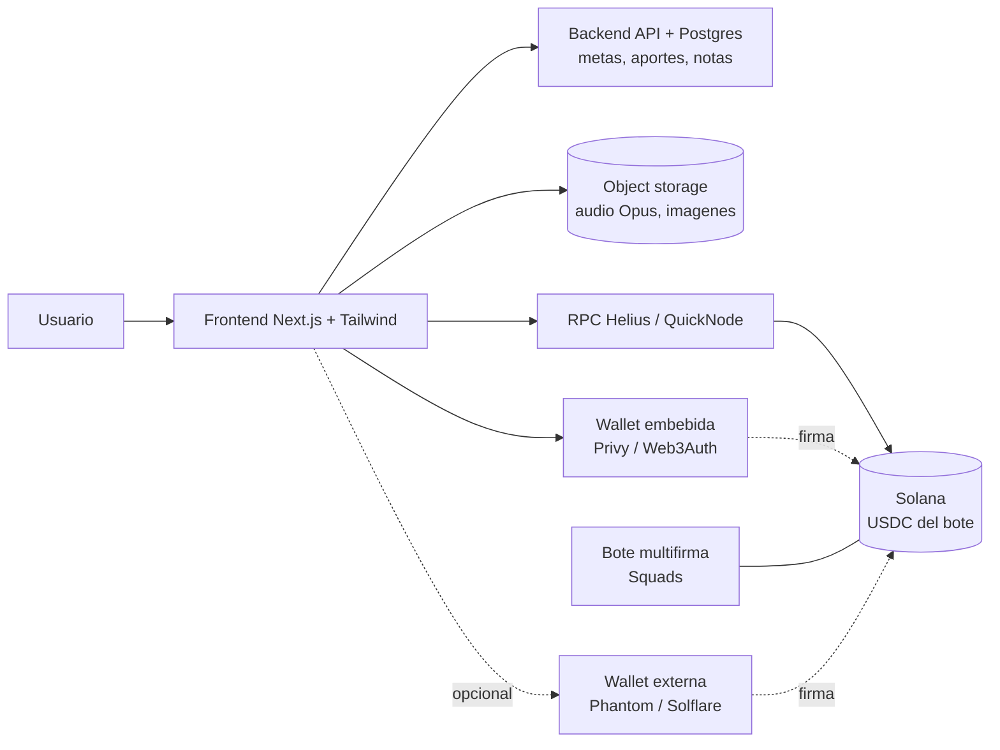

# Arquitectura técnica — Green Sol

- **Versión:** 0.5 (modelo de datos y mapa de rutas al día con la sesión del 2026-05-31, sobre v0.0.42)
- **Fecha:** 2026-05-30
- **Audiencia:** equipo con experiencia en web tradicional, principiante en web3.

> Explica, primero en lenguaje llano y luego con detalle, en qué se diferencia una app web3 de una web tradicional, y propone un stack concreto para Green Sol alineado con lo que el equipo ya domina.

---

## 1. Web2 vs Web3 explicado para no técnicos

### Cómo es una web tradicional (web2)

- **Frontend:** lo que el usuario ve en el navegador (la interfaz). HTML/CSS/JS, normalmente con React o Next.js.
- **Backend:** un servidor propio con la lógica de negocio (login, permisos, reglas).
- **Base de datos:** donde el backend guarda los datos (Postgres, etc.).

Aquí **tú controlas todo**: el servidor y la base de datos son tuyos.

### Qué cambia en web3 (Solana)

En web3, **el estado del dinero y de los activos no vive en tu base de datos: vive en la blockchain** (Solana), una base de datos pública y compartida que nadie controla en solitario.

- La blockchain es el "backend de la verdad" para **dinero, tokens y activos**: nadie puede falsear un saldo.
- La lógica que corre dentro de la blockchain se llama **programa** (en otras cadenas, "smart contract"); se escribe en Rust, a menudo con **Anchor**.
- El usuario actúa con una **wallet**: para mover fondos, **firma** con su llave. Sin firma, nadie mueve sus fondos.

### Cómo se traduce esto en Green Sol

Green Sol combina ambos mundos:

| Parte de Green Sol | Dónde vive | Por qué |
| --- | --- | --- |
| Cuentas, metas, registro de aportes, notas | Backend tradicional (Postgres) | No es dinero; necesita búsquedas, relaciones, contenido. |
| Notas de voz e imágenes | Object storage (archivos) | Pesados; ponerlos on-chain sería carísimo. |
| Bote en dólares digitales (opcional) | Solana (USDC) | Debe ser verificable y resistente a manipulación. |
| Mover fondos del bote | Solana (multifirma) | Que nadie pueda vaciarlo solo. |
| Modo espejo | Solana (solo lectura, vía RPC) | Reflejar una wallet externa sin custodiarla. |

La clave: **el nivel "sin cripto" de Green Sol es 100% web tradicional**. Solana solo entra en el nivel opcional de respaldo del bote. Por eso Green Sol es una **app híbrida con componente dApp**, no una dApp pura: solo la parte que toca la blockchain (wallets, firmas, USDC, multifirma) es "dApp"; el resto es web2.

## 2. Stack recomendado

| Capa | Tecnología | Por qué |
| --- | --- | --- |
| Frontend | **Next.js (App Router) + TypeScript + Tailwind CSS** | Mismo stack que el equipo ya usa; base para web y móvil. |
| Backend | **Next.js API routes** (o NestJS si crece) | Empezar simple. |
| Base de datos | **Postgres + Prisma** | Cuentas, metas, aportes, notas. |
| Archivos | **Object storage** (S3-compatible) | Audio (Opus) e imágenes. |
| Conexión a Solana | **@solana/web3.js** + **@solana/spl-token** | Leer saldos, manejar USDC. |
| Acceso a la red | **RPC dedicado** (Helius / QuickNode) | Los RPC públicos son lentos y limitados. |
| Wallet embebida | **Privy / Web3Auth / Turnkey** (ver sección 4) | Wallet con correo, no-custodial. |
| Wallet externa | **Solana Wallet Adapter** | Conectar Phantom, Solflare. |
| Multifirma del bote | **Squads** (protocolo multisig) | No construir multisig propio. |
| Editor de notas (Fase 3) | **TipTap** | Editor enriquecido ya hecho; reuso del que se usa en otros proyectos. |

Notas:

- **Empezar en devnet** (red de pruebas) antes de tocar mainnet.
- **RPC propio desde el día 1** (cuenta gratuita en Helius/QuickNode).
- **Audio en Opus:** el navegador graba de forma nativa en Opus (WebM/OGG), más liviano que MP3 y sin convertir.

## 3. ¿Necesitamos escribir un programa propio (Anchor)?

**No en el MVP, y probablemente tampoco en Fase 2.** Green Sol se apoya en piezas estándar ya auditadas:

- **Respaldar el bote en dólares:** se usa **USDC**, que ya es un token **SPL** existente. No se crea ningún token.
- **Bote de grupo seguro:** se usa **multifirma** vía un protocolo existente como **Squads**. No se escribe un multisig propio.
- **Modo espejo:** es solo **lectura** vía RPC. Cero programa.
- **Registro de aportes, metas, progreso, notas:** todo en el backend tradicional.

Escribir Rust/Anchor solo se justificaría si apareciera una lógica on-chain muy específica que ningún estándar cubra. No es el caso previsto. **Regla práctica: reutilizar estándares; escribir Rust solo como último recurso.**

## 4. Proveedor de wallet embebida

Permite "registro con correo → wallet creada automáticamente, sin extensión". En 2026 el estándar es que sean **no-custodiales**: parten la llave con criptografía (MPC o TEE) para que **ni la app ni el proveedor** tengan la llave completa. Ver [SEGURIDAD_Y_WALLETS.md](SEGURIDAD_Y_WALLETS.md).

| Proveedor | Enfoque | Solana | Notas (2026) |
| --- | --- | --- | --- |
| **Privy** | Wallets embebidas de consumo, TEE + sharding; login social/correo. | Sí | Adquirido por Stripe (2025). Camino corto a pagos con tarjeta/stablecoin. Más profundidad en EVM. |
| **Web3Auth** | Login social/correo con esquemas de umbral (SSS/TSS), MFA, auto-custodia. | Sí (agnóstico de cadena) | Adquirido por MetaMask/Consensys. De los más económicos para muchos usuarios. |
| **Turnkey** | Firma no-custodial con TEE, verificable, baja latencia. | Sí | El "techo" en seguridad por hardware, a cambio de más integración. |

**Recomendación para Green Sol:** Web3Auth o Privy (consumo, Solana, login con correo, integración sencilla). Turnkey si en el futuro hace falta firma de alta frecuencia. Hacer una prueba de concepto pequeña en devnet antes de comprometerse (facilidad de integración, soporte Solana real, costo por usuario, recuperación de cuenta).

## 5. Moneda, tasas y equivalencia en bolívares

El valor siempre se guarda en **USDC** (o SOL); los bolívares son solo una **vista de equivalencia**, nunca el dato real. Cada monto se muestra con un tag en Bs según la tasa que el usuario elija:

- **BCV**, **promedio USDT P2P** y **personalizada**.
- En preferencias del usuario se fija la moneda por defecto (Bs/USDC) y la tasa de referencia.

Las tasas se obtienen de **APIs externas**: una **API privada de tasas** (BCV oficial + USDT P2P) y **DexScreener** (precio SOL/USDC, pública). Uso, caché y seguridad en **[INTEGRACIONES_API.md](INTEGRACIONES_API.md)**; detalle privado (endpoints + key) en `_privado/integraciones-privadas.md` (no se sube al repo). Resumen:

- Llamar desde el **backend** y **cachear globalmente** (una consulta para toda la app, no por usuario): BCV 2×/día (09:00 y 16:00 VET), USDT y SOL cada 1–2 h. El san y la calculadora leen del caché.
- Las tasas son **informativas**: nunca se usan para mover fondos, solo para mostrar el equivalente en Bs.
- Credenciales en **variables de entorno**, **NO en el repo** (Green Sol es open source).

## 6. El bote de grupo: USDC + multifirma

- **USDC** es el dólar digital con el que se respalda el bote (token SPL). En devnet se usa un USDC de prueba o un token propio de pruebas; en mainnet, el USDC real.
- El bote es una **wallet multifirma** (vía Squads): mover fondos requiere varias aprobaciones de administradores. Ni la app ni un solo administrador pueden vaciarlo. Esto es lo que hace el ahorro en grupo seguro y confiable sin que la app custodie nada.
- **Atribución de aportes:** para saber quién aportó, lo ideal es que los aportes salgan desde direcciones de usuarios registrados en la app.

## 7. Diagrama de arquitectura

Lectura: el nivel sin cripto solo usa Frontend + Backend + Storage. La capa Solana (RPC, USDC, multifirma, wallets) es opcional y se enchufa cuando el grupo quiere respaldar el bote.

## 8. Datos del modo tradicional (sin cripto)

Para recolectas en modo tradicional, el backend (Postgres) guarda, sin nada on-chain:

- **Cuentas destino del grupo:** tipo (pago móvil / cuenta bancaria), banco (con su código), titular, número y tipo de cuenta. Visibles para el grupo, para pagar a tiempo.
- **Reportes de pago por participante:** comprobante (imagen en object storage), número de referencia, fecha, monto, banco origen/destino y la tasa aplicada.

## 9. Autenticación, KYC y roles

- **Registro/login** con **correo + contraseña**. Política de contraseña segura (mínimo: una mayúscula, un número, un símbolo) validada en cliente y servidor, con **generador aleatorio** opcional. Hash con **Argon2/bcrypt**; nunca guardar la contraseña en claro.
- **Verificación por correo:** token de confirmación enviado vía **servidor de correo propio** sobre un **dominio de prueba** (SMTP en variables de entorno). Cuenta no verificada → acceso limitado.
- **A futuro:** OAuth con **Google** (vincular a cuenta existente o registro directo); la app de Google se gestiona a nivel super-admin.
- **Datos de pago del perfil** (off-chain, modelo `MetodoPago` rediseñado): por **categoría** fiat o cripto → **moneda** (VES/USD en el MVP) → **método** (transferencia/pago_movil/efectivo/zelle/zinli/walytech/banco para fiat; usdc/sol para cripto) → datos del titular (persona natural). El organizador **selecciona** uno de estos en el asistente del san (filtrado por la moneda del san) y sus datos se **copian** a `DatosPagoRecolecta`. Las wallet de Solana habilitan, a futuro, consulta de saldo vía RPC (modo espejo).
- **Registro rápido** sin cédula. **KYC** solo para **funciones de dinero** (como los exchanges). **Decisión actual (2026-05-31):** se construye un **KYC propio manual** revisado por el super-admin como primer paso (documento cédula/pasaporte + selfie + **video de liveness** grabado en el navegador y juzgado por un humano, **sin** detección automática). Pasos **configurables por toggles** (`KYC_REQUIERE_*`). Los archivos viven en **almacenamiento privado MinIO/S3** (`lib/almacenamiento.ts`), nunca en `/public`; se acceden con **URLs firmadas temporales**. Un **proveedor tercero** (Sumsub/Veriff/MetaMap) automatizará el proceso a futuro. Diseño en `docs/superpowers/specs/2026-05-31-kyc-verificacion-identidad-design.md`.
- **Roles:** usuario, administrador de grupo, y **super-admin** con un panel interno (ruta y credenciales aparte, permisos estrictos) para auditar usuarios, grupos, métodos de pago y documentos, enviar notificaciones y frenar estafas.

## 10. Despliegue y operación

- **Pruebas / MVP:** **Vercel** (Next.js nativo, HTTPS y servidor gestionados; seguro y gratis para empezar) + Postgres gestionada + object storage para comprobantes.
- **Producción seria:** **VPS propio en contenedor** (Docker), superficie cerrada, backups, cuando el proyecto madure y haya datos reales.
- Almacenamiento ligero (capturas + texto). Secretos (API de tasas, claves de KYC, RPC) siempre en variables de entorno, nunca en el repo.
- **Almacenamiento de archivos privados (KYC):** **MinIO** (S3-compatible, self-hosted) en contenedor — en local con **podman** (`greensol-minio`, bucket `greensol-kyc`) y en el VPS junto a la app. Acceso vía SDK de S3 con **URLs firmadas** de corta expiración; el navegador sube al servidor y este reenvía a MinIO (MinIO nunca se expone a internet). Migrable a Cloudflare R2/AWS S3 sin cambiar código. Implementado en `lib/almacenamiento.ts`.

## 11. Reputación, analítica y marketplace

- **Reputación (implementada en `lib/reputacion.ts`):** tabla `Valoracion` (`deUsuarioId`, `aUsuarioId`, `recolectaId`, `voto` +1/−1, `comentario`, `creadaEn`; única por `[recolectaId, deUsuarioId, aUsuarioId]`) que se habilita al **cerrar** una recolecta. `obtenerReputacion` agrega positivos/negativos. **Puntos = estrellitas** es un **acumulado** (las valoraciones positivas recibidas), no un ratio de 5 estrellas. `nivelPorReputacion` deriva el **nivel** por umbrales de puntos: **Nuevo (0) → Confiable (5) → Destacado (15) → Estrella (30) → Leyenda (60)**, con progreso al siguiente. La **mora** generará ajustes negativos. El historial del organizador (sanes creados / completados / no concretados, montos, tipos) se deriva de las recolectas. Todo off-chain.
- **Notificaciones:** tabla `notificaciones` (`usuario_destino`, `tipo`, `titulo`, `cuerpo`, `recurso_id`/enlace, `leida`, `fecha`) para la **campanita** (persistentes). Se crean por **eventos** (entró al san, pagó/al día, moroso, completado) y por **broadcast** del super-admin (a un usuario o a todos). El helper **`notificarYCorreo`** crea la notificación **y** envía un correo (vía `mailer.ts`); ya se usa en acciones sensibles de métodos de pago y al crear un ahorro. Los **toasts** (éxito/error/advertencia/info) son solo de UI (frontend), no se persisten. Push y avisos por correo en todos los eventos del san: pendiente.
- **Tasas y calculadora:** un **scheduled job** (Vercel Cron) refresca el caché de tasas (BCV 2×/día; USDT y SOL cada 1–2 h) desde las APIs externas; toda la app y la calculadora leen del caché, nunca de la API en cada vista. Detalle en [INTEGRACIONES_API.md](INTEGRACIONES_API.md).
- **Analítica / UTM:** capturar parámetros **UTM** (source/medium/campaign) en registro e ingreso, guardados por usuario/sesión para medir adquisición y marketing. Datos sensibles aparte y cifrados; respetar privacidad.
- **Marketplace (fase 3):** las recolectas **públicas** se listan con su reputación asociada; requiere reglas de permisos, moderación y antifraude antes de abrirse.

## 12. Resumen de decisiones técnicas

- Backend tradicional para todo lo que no es dinero; Solana solo para el bote opcional.
- Stack: Next.js + TS + Tailwind + Postgres/Prisma + object storage + @solana/web3.js + RPC dedicado.
- Sin programa propio: USDC (SPL existente) + multifirma vía Squads.
- Wallet embebida no-custodial (Web3Auth/Privy) + Wallet Adapter para externas.
- Audio en Opus; archivos off-chain. Empezar en devnet.

## 13. Modelo de datos (Prisma) — estado real

Esquema en `prisma/schema.prisma` (Postgres). Modelos y enums implementados a v0.0.41:

| Modelo | Campos clave | Notas |
| --- | --- | --- |
| `Usuario` | `correo` (único), `hashContrasena?`, **`pinHash?`** (2FA PIN), **`otpCorreoActivo` (Bool)** (2FA por correo), `correoVerificado`, `rol`, `nombre?`, `apellido?`, `nombreUsuario?` (único), `fotoUrl?`, `pais?`, `monedaPreferida?`, **`onboardingCerrado` (Int)**, **`ingresos` (Int)**, `creadoEn` | `onboardingCerrado` controla el carrusel de bienvenida; `ingresos` para perfil. Relaciones: sesiones, OTP, recolectas organizadas, participaciones, notificaciones, métodos de pago, valoraciones dadas/recibidas. |
| `Sesion` | `usuarioId`, `expiraEn`, `creadaEn` | Sesión por cookie. |
| `CodigoOtp` | `usuarioId`, `hashCodigo`, `proposito`, `expiraEn`, `usado` | OTP de verificación y reseteo. |
| `TasaCache` | `fuente` (único), `datos` (Json), `actualizado` | Caché global de tasas (BCV, USDT, SOL). |
| `Recolecta` | `tipo`, `nombre`, **`descripcion?`**, `visibilidad`, `metodo`, **`moneda` (String, def. "USD")**, `montoAporte?`, `meta?`, **`frecuencia?` (String)**, **`frecuenciaDias?` (Int)**, **`cupoMiembros?` (Int)**, `estado`, `organizadorId`, `creadaEn` | `moneda` guarda `bs_bcv`/`bs_usdt`/`usdt`/`usdc`/`sol` (string, no enum). `frecuencia` = semanal/quincenal/mensual; `frecuenciaDias` = días a medida ("Personalizar"); `cupoMiembros` = nº de manos (san); `montoAporte` se calcula = meta por turno ÷ participantes. El **código** para unirse es el `id` (cuid). Tiene relación 1‑1 con `DatosPagoRecolecta`. |
| `DatosPagoRecolecta` | `recolectaId` (único), `tipo` (transferencia/pago_movil/wallet), `banco?`, `tipoCuenta?`, `numeroCuenta?`, `titular?`, `cedula?`, `telefono?`, `wallet?` | Datos a dónde paga el grupo; se **copian** del `MetodoPago` que el organizador elige en el asistente. |
| `Participante` | `recolectaId`, `usuarioId`, `unidoEn` | Único por `[recolectaId, usuarioId]`. Tiene `turno?` y `aportes`. |
| `Turno` | `recolectaId`, `participanteId` (único), `posicion`, `cobrado` | Solo posición y cobrado; **sin fechas aún** (calendario pendiente). |
| `Aporte` | `recolectaId`, `participanteId`, `monto`, `referencia?`, `comprobanteUrl?`, `estado`, `creadoEn` | Estado `reportado`/`confirmado`/`rechazado` (alimenta la pestaña Pagos). `comprobanteUrl` aún no se llena (subida de captura pendiente). |
| `Notificacion` | `usuarioId`, `tipo`, `titulo`, `cuerpo?`, `enlace?`, `leida`, `creadaEn` | Campanita persistente. |
| `MetodoPago` | `usuarioId`, **`categoria` (fiat/cripto)**, **`moneda`** (VES/USD/…/USDC/SOL), **`metodo`** (transferencia/pago_movil/efectivo/zelle/zinli/walytech/banco/usdc/sol), `alias?`, `titular?`, `cedula?`, `banco?`, `tipoCuenta?`, `numeroCuenta?`, `telefono?`, `email?`, `wallet?`, `detalle?`, **`principal` (Bool)**, `creadoEn` | **Rediseñado** (migración v0.0.37): reemplazó el par `tipo (enum) + detalle`. `principal` marca la wallet embebida (futura). |
| `Valoracion` | `recolectaId`, `deUsuarioId`, `aUsuarioId`, `voto`, `comentario?`, `creadaEn` | Reputación; única por trío. |
| `ConfiguracionApp` | `clave` (id), `valor` | **Almacén clave/valor** de la app: `SMTP_*`, `APP_*`, `BLACKLIST_NOMBRE`/`BLACKLIST_APELLIDO`/`BLACKLIST_USUARIO` y **`PLANTILLA_*`** (overrides editables de las plantillas de notificación por canal; el catálogo por defecto vive en código, `lib/correo/catalogo.ts`). |

Enums: `Rol` (`usuario`, `admin_grupo`, `super_admin`), `OtpProposito` (`verificacion`, `reset_contrasena`), `TipoRecolecta` (`san`, `vaca`), `Visibilidad` (`privado`, `publico`), `MetodoRecolecta` (`tradicional`, `cripto`), `EstadoRecolecta` (`abierta`, `activa`, `cerrada`), `EstadoAporte` (`reportado`, `confirmado`, `rechazado`). **El enum `TipoMetodoPago` se eliminó** al rediseñar `MetodoPago` (ahora `categoria`/`moneda`/`metodo` como strings).

> Pendiente en el esquema (ver `docs/IDEAS_FUTURAS.md`): campos de **referidos** (`codigoReferido`, `referidoPorId`) en `Usuario`; **fechas por turno** (`fechaInicio` + frecuencia) en `Recolecta`/`Turno` para el calendario de Pagos; un **código corto** propio para unirse (hoy se usa el `id`); y la subida de **comprobantes** (`comprobanteUrl`, vía MinIO/S3 en el VPS).

## 14. Mapa de rutas y componentes (Next.js App Router)

Estructura real bajo `app/`, `components/` y `lib/`:

**Grupos de rutas**

- **`app/(auth)/`** — fuera de la app autenticada: `login`, `registro`, `verificar` (OTP), con `actions.ts` (registro/login/cierre de sesión).
- **`app/(app)/`** — app autenticada. `layout.tsx` exige sesión, carga reputación/nivel y notificaciones, y monta `AppHeader` + `BottomNav`; `template.tsx` añade la **transición de fade** entre pestañas. Rutas:
  - `dashboard/` — hero + accesos rápidos + tasas + "Tus ahorros".
  - `sanes/` (ruta `/sanes`) — landing "Ahorros"; subrutas `crear/` (asistente por pasos, incl. el paso de **elegir método de pago del perfil**, filtrado por moneda), `unirse/` (por enlace/código, acepta `?codigo=`), `guia/` (guía visual), `[id]/` (detalle de la recolecta, con datos de pago del grupo); `actions.ts` con `crearRecolecta`, `buscarRecolecta`, `unirseARecolecta`, `invitarPorCorreo`, `generarTurnos`, `reportarPago`, `resolverAporte`, `cerrarRecolecta`, `valorar`. Al crear se usa `notificarYCorreo`.
  - `pagos/` (ruta `/pagos`) — aportes por confirmar / rechazados y ahorros activos con turno/posición.
  - `calculadora/` — usa `components/calculadora.tsx`.
  - `perfil/` — hub de cuenta (`actions.ts`: `actualizarPerfil`, `agregarMetodoPago`, `editarMetodoPago`, `eliminarMetodoPago` — los tres últimos pasan por `verificarFactores` y `notificarYCorreo`); `configuracion/` (ruta `/configuracion`, con `actions.ts`: `definirPin`, `quitarPin`, `alternarOtpCorreo`, `cambiarContrasena`) — pestañas **Datos · Verificación · Pagos · Seguridad · Avisos**. **Verificación** = checklist (correo verificado, agrega 2FA, KYC "Pronto"); **Seguridad** = "Autenticación de dos factores (2FA)" con PIN, código por correo (funcionales) y biometría/authenticator ("Pronto"), más **cambio de contraseña** (requiere ≥1 factor 2FA activo); Avisos sigue placeholder; `recompensa/` (ruta `/recompensa`) — progreso de nivel; `ayuda/` (ruta `/ayuda`) — centro de ayuda; `notificaciones/` — bandeja completa (`actions.ts`: marcar leídas).
  - `onboarding/` — carrusel a pantalla completa (`onboardingCerrado`).
- **`app/admin/`** — panel super-admin (`page.tsx`, `actions.ts`, `layout.tsx`): pestañas **Métricas · Usuarios · Configuración**; Configuración con **subpestañas General · SMTP · Plantillas · Restricciones**. SMTP con toggle SSL, remitente nombre+correo, **verificar conexión** y **enviar prueba**; **Plantillas** con editor visual (`editor-plantillas.tsx`).
- **`app/api/`** — `cron/tasas` (refresco de tasas), `health`, `usuario-disponible` (validación de nombre de usuario en vivo), `metodos-pago` (GET de los métodos del usuario, lo consume el asistente del san para filtrar por moneda y copiar los datos), `test/sesion`.

**Componentes (`components/`)**

`app-header.tsx` (logo + nivel + campana/panel de avisos), `bottom-nav.tsx` (5 ítems), `calculadora.tsx`, `tasas-resumen.tsx`, `compartir-ahorro.tsx`, `unirse-ahorro.tsx`, `carrusel-onboarding.tsx`, `panel-tabs.tsx` (pestañas reusadas en configuración y admin), `toggle-admin.tsx`, `form-datos.tsx`, **`form-metodo-pago.tsx`** (alta de método: categoría → moneda buscable —con futuras "Pronto"— → método → datos), **`metodo-pago-item.tsx`** (ítem con editar/eliminar, ambos piden clave), **`select-banco.tsx`** (selector buscable de bancos VE), `campo-contrasena.tsx`, `campo-usuario.tsx`, **`form-smtp.tsx`** (config SMTP) + **`prueba-smtp.tsx`**, **`editor-plantillas.tsx`** (editor visual de plantillas: tarjetas + modal app/correo + barra de formato), **`form-seguridad.tsx`** (2FA: PIN/OTP + cambio de contraseña), **`banner-verificacion.tsx`** y **`seccion-verificacion.tsx`** (verificación inicial), **`fuerza-contrasena.tsx`** (medidor en el registro), y las pantallas de auth rediseñadas **`auth-shell.tsx`** / **`wordmark.tsx`** / **`fondo-marca.tsx`** / **`botones-wallet.tsx`**; y primitivas en `components/ui/`.

**Librería (`lib/`)**

`auth/` (sesión, OTP, password con Argon2), `db.ts` (Prisma), `config.ts` (claves `SMTP_*`/`APP_*` en `ConfiguracionApp`), `reputacion.ts` (puntos/niveles), `restricciones.ts` (lista negra `BLACKLIST_*`), **`seguridad.ts`** (`verificarFactores` valida **clave + PIN + OTP por correo**; `factoresActivos`), **`correo/`** (`plantillas.ts` layout HTML de marca, `catalogo.ts` eventos + canales + variables, `resolver.ts` override DB→default), `notificaciones.ts` (`crearNotificacion`, `notificarVarios`, `contarNoLeidas` y **`notificarYCorreo`** = campanita + correo), `onboarding.ts`, `mailer.ts` (SMTP con soporte HTML + `verificarConexionSmtp`), `rates/` (caché de tasas), **`monedas.ts`** (`MONEDAS_FIAT` + `MONEDAS_FIAT_FUTURAS`, métodos por moneda, `CRIPTO_OPCIONES`, etiquetas), **`bancos-venezuela.ts`** (25 bancos VE por código), `validations/` (esquemas Zod, incl. `recolecta.ts` con monedas y frecuencias), `paises.ts`, `utils.ts`.
