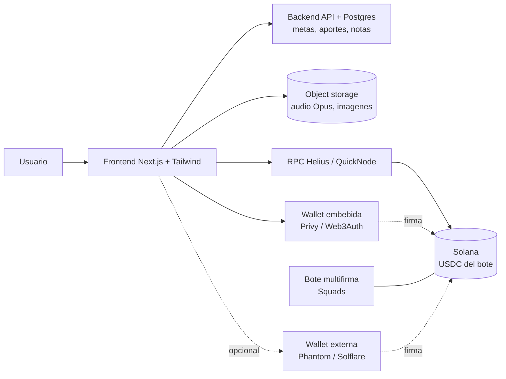

# Arquitectura técnica — Green Sol

- **Versión:** 0.2 (enfocada en Green Sol)
- **Fecha:** 2026-05-29
- **Audiencia:** equipo con experiencia en web tradicional, principiante en web3.

> Explica, primero en lenguaje llano y luego con detalle, en qué se diferencia una app web3 de una web tradicional, y propone un stack concreto para Green Sol alineado con lo que el equipo ya domina.

---

## 1. Web2 vs Web3 explicado para no técnicos

### Cómo es una web tradicional (web2)

- **Frontend:** lo que el usuario ve en el navegador (la interfaz). HTML/CSS/JS, normalmente con React o Next.js.
- **Backend:** un servidor propio con la lógica de negocio (login, permisos, reglas).
- **Base de datos:** donde el backend guarda los datos (Postgres, etc.).

Aquí **tú controlas todo**: el servidor y la base de datos son tuyos.

### Qué cambia en web3 (Solana)

En web3, **el estado del dinero y de los activos no vive en tu base de datos: vive en la blockchain** (Solana), una base de datos pública y compartida que nadie controla en solitario.

- La blockchain es el "backend de la verdad" para **dinero, tokens y activos**: nadie puede falsear un saldo.
- La lógica que corre dentro de la blockchain se llama **programa** (en otras cadenas, "smart contract"); se escribe en Rust, a menudo con **Anchor**.
- El usuario actúa con una **wallet**: para mover fondos, **firma** con su llave. Sin firma, nadie mueve sus fondos.

### Cómo se traduce esto en Green Sol

Green Sol combina ambos mundos:

| Parte de Green Sol | Dónde vive | Por qué |
| --- | --- | --- |
| Cuentas, metas, registro de aportes, notas | Backend tradicional (Postgres) | No es dinero; necesita búsquedas, relaciones, contenido. |
| Notas de voz e imágenes | Object storage (archivos) | Pesados; ponerlos on-chain sería carísimo. |
| Bote en dólares digitales (opcional) | Solana (USDC) | Debe ser verificable y resistente a manipulación. |
| Mover fondos del bote | Solana (multifirma) | Que nadie pueda vaciarlo solo. |
| Modo espejo | Solana (solo lectura, vía RPC) | Reflejar una wallet externa sin custodiarla. |

La clave: **el nivel "sin cripto" de Green Sol es 100% web tradicional**. Solana solo entra en el nivel opcional de respaldo del bote.

## 2. Stack recomendado

| Capa | Tecnología | Por qué |
| --- | --- | --- |
| Frontend | **Next.js (App Router) + TypeScript + Tailwind CSS** | Mismo stack que el equipo ya usa; base para web y móvil. |
| Backend | **Next.js API routes** (o NestJS si crece) | Empezar simple. |
| Base de datos | **Postgres + Prisma** | Cuentas, metas, aportes, notas. |
| Archivos | **Object storage** (S3-compatible) | Audio (Opus) e imágenes. |
| Conexión a Solana | **@solana/web3.js** + **@solana/spl-token** | Leer saldos, manejar USDC. |
| Acceso a la red | **RPC dedicado** (Helius / QuickNode) | Los RPC públicos son lentos y limitados. |
| Wallet embebida | **Privy / Web3Auth / Turnkey** (ver sección 4) | Wallet con correo, no-custodial. |
| Wallet externa | **Solana Wallet Adapter** | Conectar Phantom, Solflare. |
| Multifirma del bote | **Squads** (protocolo multisig) | No construir multisig propio. |
| Editor de notas (Fase 3) | **TipTap** | Editor enriquecido ya hecho; reuso del que se usa en otros proyectos. |

Notas:

- **Empezar en devnet** (red de pruebas) antes de tocar mainnet.
- **RPC propio desde el día 1** (cuenta gratuita en Helius/QuickNode).
- **Audio en Opus:** el navegador graba de forma nativa en Opus (WebM/OGG), más liviano que MP3 y sin convertir.

## 3. ¿Necesitamos escribir un programa propio (Anchor)?

**No en el MVP, y probablemente tampoco en Fase 2.** Green Sol se apoya en piezas estándar ya auditadas:

- **Respaldar el bote en dólares:** se usa **USDC**, que ya es un token **SPL** existente. No se crea ningún token.
- **Bote de grupo seguro:** se usa **multifirma** vía un protocolo existente como **Squads**. No se escribe un multisig propio.
- **Modo espejo:** es solo **lectura** vía RPC. Cero programa.
- **Registro de aportes, metas, progreso, notas:** todo en el backend tradicional.

Escribir Rust/Anchor solo se justificaría si apareciera una lógica on-chain muy específica que ningún estándar cubra. No es el caso previsto. **Regla práctica: reutilizar estándares; escribir Rust solo como último recurso.**

## 4. Proveedor de wallet embebida

Permite "registro con correo → wallet creada automáticamente, sin extensión". En 2026 el estándar es que sean **no-custodiales**: parten la llave con criptografía (MPC o TEE) para que **ni la app ni el proveedor** tengan la llave completa. Ver [SEGURIDAD_Y_WALLETS.md](SEGURIDAD_Y_WALLETS.md).

| Proveedor | Enfoque | Solana | Notas (2026) |
| --- | --- | --- | --- |
| **Privy** | Wallets embebidas de consumo, TEE + sharding; login social/correo. | Sí | Adquirido por Stripe (2025). Camino corto a pagos con tarjeta/stablecoin. Más profundidad en EVM. |
| **Web3Auth** | Login social/correo con esquemas de umbral (SSS/TSS), MFA, auto-custodia. | Sí (agnóstico de cadena) | Adquirido por MetaMask/Consensys. De los más económicos para muchos usuarios. |
| **Turnkey** | Firma no-custodial con TEE, verificable, baja latencia. | Sí | El "techo" en seguridad por hardware, a cambio de más integración. |

**Recomendación para Green Sol:** Web3Auth o Privy (consumo, Solana, login con correo, integración sencilla). Turnkey si en el futuro hace falta firma de alta frecuencia. Hacer una prueba de concepto pequeña en devnet antes de comprometerse (facilidad de integración, soporte Solana real, costo por usuario, recuperación de cuenta).

## 5. Moneda, tasas y equivalencia en bolívares

El valor siempre se guarda en **USDC** (o SOL); los bolívares son solo una **vista de equivalencia**, nunca el dato real. Cada monto se muestra con un tag en Bs según la tasa que el usuario elija:

- **BCV**, **promedio USDT P2P** y **personalizada**.
- En preferencias del usuario se fija la moneda por defecto (Bs/USDC) y la tasa de referencia.

Las tasas se obtienen de una **API externa de consulta** (de un desarrollador venezolano en España) que entrega BCV, promedio USDT y otra referencia. Consideraciones de implementación:

- Llamar la API desde el **backend** (no exponer credenciales en el frontend); cachear las tasas (p. ej. refrescar cada X minutos) para no consultar en cada vista.
- Las tasas son **informativas**: nunca se usan para mover fondos, solo para mostrar el equivalente en Bs.
- Pendiente: documentar endpoint/credenciales de la API (van en variables de entorno, NO en el repo).

## 6. El bote de grupo: USDC + multifirma

- **USDC** es el dólar digital con el que se respalda el bote (token SPL). En devnet se usa un USDC de prueba o un token propio de pruebas; en mainnet, el USDC real.
- El bote es una **wallet multifirma** (vía Squads): mover fondos requiere varias aprobaciones de administradores. Ni la app ni un solo administrador pueden vaciarlo. Esto es lo que hace el ahorro en grupo seguro y confiable sin que la app custodie nada.
- **Atribución de aportes:** para saber quién aportó, lo ideal es que los aportes salgan desde direcciones de usuarios registrados en la app.

## 7. Diagrama de arquitectura

Lectura: el nivel sin cripto solo usa Frontend + Backend + Storage. La capa Solana (RPC, USDC, multifirma, wallets) es opcional y se enchufa cuando el grupo quiere respaldar el bote.

## 8. Resumen de decisiones técnicas

- Backend tradicional para todo lo que no es dinero; Solana solo para el bote opcional.
- Stack: Next.js + TS + Tailwind + Postgres/Prisma + object storage + @solana/web3.js + RPC dedicado.
- Sin programa propio: USDC (SPL existente) + multifirma vía Squads.
- Wallet embebida no-custodial (Web3Auth/Privy) + Wallet Adapter para externas.
- Audio en Opus; archivos off-chain. Empezar en devnet.
