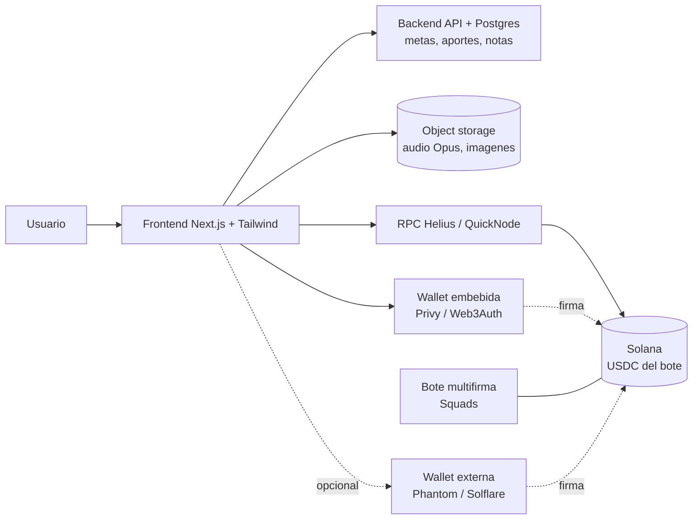

# Arquitectura técnica — Green Sol

- **Versión:** 0.12 (sobre v0.2.6 — completa el **motor de rondas (fases 2 y 3)**: cada `Aporte` se sella a su `ronda`; `lib/san/rondas.ts` calcula **fechas de corte** (`fechaInicio + (ronda−1)·díasFrecuencia`), **puntualidad** (a tiempo / adelantado / con atraso, a nivel de día y sin gracia), **mora** informativa (`TipoMora {ninguna|fijo|porcentaje}`) y el **estado de la ronda**; el organizador **entrega el bote al cobrador** (`reportarEntrega`, con datos de pago copiables + declaración + PIN) y **avanza/cierra ronda** (`iniciarSiguienteRonda`) hasta finalizar; sección **"Cuentas por pagar"** (`app/(app)/pagos`) con calendario de vencimientos derivado de las fechas de corte; y refinamientos de la pestaña Pagos —notificaciones con `enlace` navegable, tarjeta de método de pago colapsable, donas configurables (`colorBase`/`colorProgreso`/`gradiente`)—. Construido sobre la **fase 1** (v0.1.0: inicio del san con sorteo de turnos en tres modos —manual, aleatorio y ruleta animada con sonido—) y sobre v0.0.117 —invitación con solicitud de unión, portero de verificación KYC + PIN, pestañas Miembros y Pagos—. Detalle en `CHANGELOG.md` (`[0.2.0]`, `[0.2.6]`, `[0.0.137]`, `[0.0.117]`) y en `docs/superpowers/specs/2026-06-03-motor-rondas-san-design.md` + `docs/superpowers/specs/2026-06-03-invitacion-miembros-pagos-design.md`)
- **Fecha:** 2026-06-04
- **Audiencia:** equipo con experiencia en web tradicional, principiante en web3.

> Explica, primero en lenguaje llano y luego con detalle, en qué se diferencia una app web3 de una web tradicional, y propone un stack concreto para Green Sol alineado con lo que el equipo ya domina.

---

## 1. Web2 vs Web3 explicado para no técnicos

### Cómo es una web tradicional (web2)

- **Frontend:** lo que el usuario ve en el navegador (la interfaz). HTML/CSS/JS, normalmente con React o Next.js.
- **Backend:** un servidor propio con la lógica de negocio (login, permisos, reglas).
- **Base de datos:** donde el backend guarda los datos (Postgres, etc.).

Aquí **tú controlas todo**: el servidor y la base de datos son tuyos.

### Qué cambia en web3 (Solana)

En web3, **el estado del dinero y de los activos no vive en tu base de datos: vive en la blockchain** (Solana), una base de datos pública y compartida que nadie controla en solitario.

- La blockchain es el "backend de la verdad" para **dinero, tokens y activos**: nadie puede falsear un saldo.
- La lógica que corre dentro de la blockchain se llama **programa** (en otras cadenas, "smart contract"); se escribe en Rust, a menudo con **Anchor**.
- El usuario actúa con una **wallet**: para mover fondos, **firma** con su llave. Sin firma, nadie mueve sus fondos.

### Cómo se traduce esto en Green Sol

Green Sol combina ambos mundos:

| Parte de Green Sol | Dónde vive | Por qué |
| --- | --- | --- |
| Cuentas, metas, registro de aportes, notas | Backend tradicional (Postgres) | No es dinero; necesita búsquedas, relaciones, contenido. |
| Notas de voz e imágenes | Object storage (archivos) | Pesados; ponerlos on-chain sería carísimo. |
| Bote en dólares digitales (opcional) | Solana (USDC) | Debe ser verificable y resistente a manipulación. |
| Mover fondos del bote | Solana (multifirma) | Que nadie pueda vaciarlo solo. |
| Modo espejo | Solana (solo lectura, vía RPC) | Reflejar una wallet externa sin custodiarla. |

La clave: **el nivel "sin cripto" de Green Sol es 100% web tradicional**. Solana solo entra en el nivel opcional de respaldo del bote. Por eso Green Sol es una **app híbrida con componente dApp**, no una dApp pura: solo la parte que toca la blockchain (wallets, firmas, USDC, multifirma) es "dApp"; el resto es web2.

## 2. Stack recomendado

| Capa | Tecnología | Por qué |
| --- | --- | --- |
| Frontend | **Next.js (App Router) + TypeScript + Tailwind CSS** | Mismo stack que el equipo ya usa; base para web y móvil. |
| Backend | **Next.js API routes** (o NestJS si crece) | Empezar simple. |
| Base de datos | **Postgres + Prisma** | Cuentas, metas, aportes, notas. |
| Archivos | **Object storage** (S3-compatible) | Audio (Opus) e imágenes. |
| Conexión a Solana | **@solana/web3.js** + **@solana/spl-token** | Leer saldos, manejar USDC. |
| Acceso a la red | **RPC dedicado** (Helius / QuickNode) | Los RPC públicos son lentos y limitados. |
| Wallet embebida | **Privy / Web3Auth / Turnkey** (ver sección 4) | Wallet con correo, no-custodial. |
| Wallet externa | **Solana Wallet Adapter** | Conectar Phantom, Solflare. |
| Multifirma del bote | **Squads** (protocolo multisig) | No construir multisig propio. |
| Editor de notas (Fase 3) | **TipTap** | Editor enriquecido ya hecho; reuso del que se usa en otros proyectos. |

Notas:

- **Empezar en devnet** (red de pruebas) antes de tocar mainnet.
- **RPC propio desde el día 1** (cuenta gratuita en Helius/QuickNode).
- **Audio en Opus:** el navegador graba de forma nativa en Opus (WebM/OGG), más liviano que MP3 y sin convertir.

## 3. ¿Necesitamos escribir un programa propio (Anchor)?

**No en el MVP, y probablemente tampoco en Fase 2.** Green Sol se apoya en piezas estándar ya auditadas:

- **Respaldar el bote en dólares:** se usa **USDC**, que ya es un token **SPL** existente. No se crea ningún token.
- **Bote de grupo seguro:** se usa **multifirma** vía un protocolo existente como **Squads**. No se escribe un multisig propio.
- **Modo espejo:** es solo **lectura** vía RPC. Cero programa.
- **Registro de aportes, metas, progreso, notas:** todo en el backend tradicional.

Escribir Rust/Anchor solo se justificaría si apareciera una lógica on-chain muy específica que ningún estándar cubra. No es el caso previsto. **Regla práctica: reutilizar estándares; escribir Rust solo como último recurso.**

## 4. Proveedor de wallet embebida

Permite "registro con correo → wallet creada automáticamente, sin extensión". En 2026 el estándar es que sean **no-custodiales**: parten la llave con criptografía (MPC o TEE) para que **ni la app ni el proveedor** tengan la llave completa. Ver [SEGURIDAD_Y_WALLETS.md](SEGURIDAD_Y_WALLETS.md).

| Proveedor | Enfoque | Solana | Notas (2026) |
| --- | --- | --- | --- |
| **Privy** | Wallets embebidas de consumo, TEE + sharding; login social/correo. | Sí | Adquirido por Stripe (2025). Camino corto a pagos con tarjeta/stablecoin. Más profundidad en EVM. |
| **Web3Auth** | Login social/correo con esquemas de umbral (SSS/TSS), MFA, auto-custodia. | Sí (agnóstico de cadena) | Adquirido por MetaMask/Consensys. De los más económicos para muchos usuarios. |
| **Turnkey** | Firma no-custodial con TEE, verificable, baja latencia. | Sí | El "techo" en seguridad por hardware, a cambio de más integración. |

**Recomendación para Green Sol:** Web3Auth o Privy (consumo, Solana, login con correo, integración sencilla). Turnkey si en el futuro hace falta firma de alta frecuencia. Hacer una prueba de concepto pequeña en devnet antes de comprometerse (facilidad de integración, soporte Solana real, costo por usuario, recuperación de cuenta).

## 5. Moneda, tasas y equivalencia en bolívares

El valor siempre se guarda en **USDC** (o SOL); los bolívares son solo una **vista de equivalencia**, nunca el dato real. Cada monto se muestra con un tag en Bs según la tasa que el usuario elija:

- **BCV**, **promedio USDT P2P** y **personalizada**.
- En preferencias del usuario se fija la moneda por defecto (Bs/USDC) y la tasa de referencia.

Las tasas se obtienen de **APIs externas**: una **API privada de tasas** (BCV oficial + USDT P2P) y **DexScreener** (precio SOL/USDC, pública). Uso, caché y seguridad en **[INTEGRACIONES_API.md](INTEGRACIONES_API.md)**; detalle privado (endpoints + key) en `_privado/integraciones-privadas.md` (no se sube al repo). Resumen:

- Llamar desde el **backend** y **cachear globalmente** (una consulta para toda la app, no por usuario). El san y la calculadora leen del caché.
- Las tasas son **informativas**: nunca se usan para mover fondos, solo para mostrar el equivalente en Bs.
- Credenciales en **variables de entorno**, **NO en el repo** (Green Sol es open source).

### Implementación del caché y el planificador de tasas

**Fetchers (`lib/rates/fetchers.ts`):** tres funciones de obtención de datos crudos — BCV vía CDN público, USDT vía la API privada `dolarvzla` (requiere `DOLARVZLA_API_KEY` en env), SOL vía DexScreener (pública).

**Caché (`lib/rates/cache.ts`):** tabla `TasaCache` en Postgres con `fuente` como clave única, `datos` JSON y `actualizado`. La función `refrescarTasas(grupo)` acepta `grupo: "todo" | "cripto" | "bcv"` (default `"todo"`): `"cripto"` refresca SOL y USDT; `"bcv"` refresca solo BCV. `obtenerTasas()` lee el caché de forma síncrona para el resto de la app.

**Planificador en servidor (`lib/rates/scheduler.ts`):** `iniciarSchedulerTasas()` con guard de idempotencia (no se registra doble). Al arrancar: refresco inicial completo de las tres fuentes. Después: `setInterval` de 30 minutos que siempre refresca `"cripto"` (SOL y USDT), y refresca `"bcv"` solo si la hora actual en `America/Caracas` es una de las franjas configuradas: **6, 11, 14 y 19 h** (usando `Intl.DateTimeFormat` para calcular la hora local venezolana sin dependencias externas).

**Hook de arranque (`instrumentation.ts` en raíz del proyecto):** Next.js 15+ expone el hook `register()` en `instrumentation.ts`. Green Sol lo usa exclusivamente bajo `runtime === "nodejs"` para llamar a `iniciarSchedulerTasas()` en el arranque del servidor. No requiere ningún flag adicional en `next.config.ts` (instrumentation está estable desde Next 15).

**Ruta de cron externa (`/api/cron/tasas`):** complementa el planificador en servidor. Acepta el parámetro `?grupo=todo|cripto|bcv` para disparar un refresco de un grupo específico desde Vercel Cron o cualquier cron externo. Protegida con `CRON_SECRET` en el header de autorización.

### Monedas de recolecta y guía visual

**`lib/validations/recolecta.ts`** define las etiquetas de `MONEDA_RECOLECTA`: `bs_bcv` ("Bolívares · tasa BCV"), `bs_usdt` ("Bolívares · promedio"), `usdt` ("USDT · dólar paralelo"), `usdc` ("USDC (Solana)"), `sol` ("SOL (Solana)"). La etiqueta para `usdc` hace explícito que es el token en la red Solana; `sol` ya no dice "Solana (SOL)" para no confundir con USDC que también vive en Solana.

**`components/guia-monedas.tsx`**: componente que explica la diferencia entre monedas fiat (Bolívares con tasa BCV o promedio) y monedas cripto (USDC y SOL en la red Solana), con tarjetas visuales y nota sobre qué es cada una. Se usa en dos contextos: la ruta `app/(app)/sanes/guia/page.tsx` (pestaña de guía de ahorros) y un modal desplegable en el paso de selección de moneda del asistente de creación (`app/(app)/sanes/crear/page.tsx` → botón "¿Cuál elijo?").

## 6. El bote de grupo: USDC + multifirma

- **USDC** es el dólar digital con el que se respalda el bote (token SPL). En devnet se usa un USDC de prueba o un token propio de pruebas; en mainnet, el USDC real.
- El bote es una **wallet multifirma** (vía Squads): mover fondos requiere varias aprobaciones de administradores. Ni la app ni un solo administrador pueden vaciarlo. Esto es lo que hace el ahorro en grupo seguro y confiable sin que la app custodie nada.
- **Atribución de aportes:** para saber quién aportó, lo ideal es que los aportes salgan desde direcciones de usuarios registrados en la app.

## 7. Diagrama de arquitectura

```mermaid
flowchart LR
    U[Usuario] --> FE[Frontend Next.js + Tailwind]
    FE --> BE[Backend API + Postgres\nmetas, aportes, notas]
    FE --> ST[(Object storage\naudio Opus, imagenes)]
    FE --> EW[Wallet embebida\nPrivy / Web3Auth]
    FE --> RPC[RPC Helius / QuickNode]
    RPC --> SOL[(Solana\nUSDC del bote)]
    EW -. firma .-> SOL
    BOTE[Bote multifirma\nSquads] --- SOL
    FE -. opcional .-> EXT[Wallet externa\nPhantom / Solflare]
    EXT -. firma .-> SOL
```

Lectura: el nivel sin cripto solo usa Frontend + Backend + Storage. La capa Solana (RPC, USDC, multifirma, wallets) es opcional y se enchufa cuando el grupo quiere respaldar el bote.

## 8. Datos del modo tradicional (sin cripto)

Para recolectas en modo tradicional, el backend (Postgres) guarda, sin nada on-chain:

- **Cuentas destino del grupo:** tipo (pago móvil / cuenta bancaria), banco (con su código), titular, número y tipo de cuenta. Visibles para el grupo, para pagar a tiempo.
- **Reportes de pago por participante:** comprobante (imagen en object storage), número de referencia, fecha, monto, banco origen/destino y la tasa aplicada.

## 9. Autenticación, KYC y roles

### 9a. PIN como credencial principal de acceso

El **PIN de 6 dígitos** es la credencial principal de login en Green Sol (no la contraseña, que actúa como "factor fuerte" reservado para operaciones cripto futuras). El OTP por correo es verificación de acciones, no credencial de login.

**Modelo de datos:** los campos `pinHash` (hash Argon2 del PIN), `pinIntentos` (contador de intentos fallidos) y `pinBloqueadoHasta` (timestamp de desbloqueo) viven en `Usuario`. La migración `seguridad_factores` añadió `pinHash`/`otpCorreoActivo`; la migración `bloqueo_pin` añadió `pinIntentos`/`pinBloqueadoHasta`.

**Lógica de PIN (`lib/auth/pin.ts`):**
- `pinFormatoValido(pin)` — valida que sean exactamente 6 dígitos y que no sea trivial (no repeticiones ni secuencias como 123456).
- `hashearPin(pin)` — genera el hash Argon2 con la política configurada.
- `verificarPin(usuarioId, pin)` — lee `pinIntentos`/`pinBloqueadoHasta`, rechaza si la cuenta está bloqueada, compara el hash con Argon2, incrementa el contador en fallo, resetea en éxito. Bloquea la cuenta tras **5 intentos fallidos** durante **15 minutos** (escribe `pinBloqueadoHasta`).

**Componente `components/campo-pin.tsx`:**
Entrada de PIN de 6 casillas independientes con navegación automática entre ellas (avance al completar, retroceso con Backspace). Props relevantes: `oculto` (por defecto `true` → `type="password"`, los dígitos se enmascaran inmediatamente), `onCompleto` (callback al llenar los 6 dígitos), `autoFocus`. Implementado con `forwardRef` que expone un handle con método `reset()` para vaciar el campo desde el componente padre. Cuando se usa en pares (crear PIN / confirmar PIN), el wizard muestra retroalimentación visual de coincidencia en tiempo real: verde si ambos campos coinciden, rojo si no.

**Flujo de registro (wizard multi-paso, `app/(auth)/registro/wizard.tsx`):**
1. **Correo** → `solicitarRegistro` (guarda correo+contraseña en la cookie `COOKIE_PENDIENTE`; envía OTP).
2. **Verificar OTP** → `verificarCodigo` (distingue registro de login por `correoVerificado`; marca el OTP como usado, pasa al siguiente paso sin abrir sesión todavía).
3. **Crear PIN** → `definirPinRegistro` (valida con `pinFormatoValido`, hace hash con `hashearPin`, guarda en `COOKIE_PENDIENTE`).
4. **Datos personales** (nombre, apellido, @usuario, país) → `completarRegistro` (crea el usuario en BD con `pinHash` ya incluido, abre sesión, limpia la cookie, envía notificación de bienvenida con enlace al KYC).
5. **Pantalla de completado** — confirmación visual y enlace a login.

En los pasos intermedios (2 y 3) aparece el enlace **"Empezar otro registro"** que llama a `cancelarRegistro` (borra la cookie `COOKIE_PENDIENTE`) tras confirmación, permitiendo a alguien que bloqueó el flujo con un correo ya registrado o que se arrepintió empezar de cero.

Server Actions del wizard: `solicitarRegistro`, `verificar` (OTP), `definirPinRegistro`, `completarRegistro`, `cancelarRegistro` — todas en `app/(auth)/actions.ts`.

**Cookie y señal de control (`app/(auth)/constants.ts`):**
- `COOKIE_PENDIENTE` — cookie httpOnly que persiste el estado intermedio del wizard de registro (correo, hash temporal, paso alcanzado). Se crea en `solicitarRegistro` y se borra en `completarRegistro` o `cancelarRegistro`.
- `SENAL_MIGRAR_PIN` — señal devuelta por `iniciarSesion` cuando el usuario tiene `hashContrasena` pero no `pinHash` (usuario creado antes de v0.0.70); redirige a `/migrar-pin`.

**Flujo de login (`app/(auth)/login/page.tsx`):**
Wizard de 2 pasos controlado con React state: primero el correo/usuario, luego el PIN (o contraseña si no tiene PIN). `iniciarSesion` reescrito para usar `loginPinSchema` (Zod), devuelve `SENAL_MIGRAR_PIN` si el usuario no tiene `pinHash`. El campo identificador es controlado (no se pierde entre pasos tras un error en React 19). El `pinActualRef` evita stale closure al auto-enviar cuando `CampoPin.onCompleto` dispara.

**Migración `/migrar-pin` (`app/(auth)/migrar-pin/page.tsx`):**
Para usuarios creados antes del PIN. Muestra AuthShell con campo de contraseña actual + 2×CampoPin (crear/confirmar). Server Action `crearPinMigracion`: verifica contraseña legacy, valida PIN con `pinSchema` + `pinFormatoValido`, guarda `pinHash` conservando `hashContrasena`, abre sesión y redirige al dashboard. Endpoint de test `app/api/test/seed-migrar/route.ts` siembra un usuario con contraseña pero sin PIN (solo en dev).

**Gestión del PIN en Configuración (`app/(app)/configuracion/actions.ts`):**
- `definirPin(formData)` — confirma identidad con el **PIN actual** (usando `verificarPin`, que aplica el bloqueo). Si el usuario no tiene PIN pero sí contraseña, pide la contraseña como fallback. Usa `pinFormatoValido` para validar el nuevo PIN y `hashearPin` para guardarlo.
- `quitarPin(formData)` — bloquea la operación si el usuario no tiene `hashContrasena` (anti-lockout: si el PIN es la única credencial, no se puede quitar). En la UI se oculta el formulario y se muestra un aviso con enlace conceptual al "Factor fuerte".

El login rechaza el acceso a usuarios con `baneado = true`.

### 9b. Registro/login base y contraseña

El sistema original de **correo + contraseña** se conserva como base. Política de contraseña segura (mínimo: mayúscula, número, símbolo) validada en cliente y servidor, con **generador aleatorio** opcional. Hash con **Argon2**; nunca en claro. **Verificación por correo:** OTP de 6 dígitos enviado con la plantilla HTML de marca (`correo_otp`), editable desde el editor de plantillas; el asunto dice "Verifica tu correo". **A futuro:** OAuth con **Google** (vincular a cuenta existente o registro directo).

### 9c. Datos de pago, KYC y roles

- **Datos de pago del perfil** (off-chain, modelo `MetodoPago` rediseñado): por **categoría** fiat o cripto → **moneda** (VES/USD en el MVP) → **método** (transferencia/pago_movil/efectivo/zelle/zinli/walytech/banco para fiat; usdc/sol para cripto) → datos del titular (persona natural). El organizador **selecciona** uno de estos en el asistente del san (filtrado por la moneda del san) y sus datos se **copian** a `DatosPagoRecolecta`. Las wallet de Solana habilitan, a futuro, consulta de saldo vía RPC (modo espejo).
- **Registro rápido** sin cédula. **KYC** solo para **funciones de dinero** (como los exchanges). **Decisión actual (2026-05-31):** se construye un **KYC propio manual** revisado por el super-admin como primer paso (documento cédula/pasaporte + selfie + **video de liveness** grabado en el navegador y juzgado por un humano, **sin** detección automática). Pasos **configurables por toggles** (`KYC_REQUIERE_*`). Los archivos viven en **almacenamiento privado MinIO/S3** (`lib/almacenamiento.ts`), nunca en `/public`; se acceden con **URLs firmadas temporales**. Un **proveedor tercero** (Sumsub/Veriff/MetaMap) automatizará el proceso a futuro. Diseño en `docs/superpowers/specs/2026-05-31-kyc-verificacion-identidad-design.md`.
- **Roles:** **2 roles activos** — `usuario` (por defecto) y `super_admin` (panel `/admin`). El rol `admin_grupo` fue eliminado del enum (migración `20260602012525_roles_sin_admin_grupo`). El `layout.tsx` de `/admin` bloquea con `notFound()` a cualquier usuario que no sea `super_admin`. El login de usuarios con `baneado = true` es rechazado en `iniciarSesion`.

## 10. Despliegue y operación

- **Pruebas / MVP:** **Vercel** (Next.js nativo, HTTPS y servidor gestionados; seguro y gratis para empezar) + Postgres gestionada + object storage para comprobantes.
- **Producción seria:** **VPS propio en contenedor** (Docker), superficie cerrada, backups, cuando el proyecto madure y haya datos reales.
- Almacenamiento ligero (capturas + texto). Secretos (API de tasas, claves de KYC, RPC) siempre en variables de entorno, nunca en el repo.
- **Almacenamiento de archivos privados (KYC):** **MinIO** (S3-compatible, self-hosted) en contenedor — en local con **podman** (`greensol-minio`, bucket `greensol-kyc`) y en el VPS junto a la app. Acceso vía SDK de S3 con **URLs firmadas** de corta expiración; el navegador sube al servidor y este reenvía a MinIO (MinIO nunca se expone a internet). Migrable a Cloudflare R2/AWS S3 sin cambiar código. Implementado en `lib/almacenamiento.ts`.

## 11. Reputación, analítica y marketplace

- **Reputación (implementada en `lib/reputacion.ts`):** tabla `Valoracion` (`deUsuarioId`, `aUsuarioId`, `recolectaId`, `voto` +1/−1, `comentario`, `creadaEn`; única por `[recolectaId, deUsuarioId, aUsuarioId]`) que se habilita al **cerrar** una recolecta. `obtenerReputacion` agrega positivos/negativos. **Puntos = estrellitas** es un **acumulado** (las valoraciones positivas recibidas), no un ratio de 5 estrellas. `nivelPorReputacion` deriva el **nivel** por umbrales de puntos: **Nuevo (0) → Confiable (5) → Destacado (15) → Estrella (30) → Leyenda (60)**, con progreso al siguiente. La **mora** generará ajustes negativos. El historial del organizador (sanes creados / completados / no concretados, montos, tipos) se deriva de las recolectas. Todo off-chain.
- **Notificaciones:** tabla `notificaciones` (`usuario_destino`, `tipo`, `titulo`, `cuerpo`, `recurso_id`/enlace, `leida`, `fecha`) para la **campanita** (persistentes). Se crean por **eventos** (entró al san, pagó/al día, moroso, completado) y por **broadcast** del super-admin (a un usuario o a todos). El helper **`notificarYCorreo`** crea la notificación **y** envía un correo (vía `mailer.ts`); ya se usa en acciones sensibles de métodos de pago, al crear un ahorro y en todos los eventos del san. Los **toasts** (éxito/error/advertencia/info) son solo de UI (frontend), no se persisten. **Eventos del san implementados en `lib/correo/catalogo.ts` (v0.0.100–v0.0.137):** `union_san` (canales: app+correo; destino: organizador; se dispara en la unión directa a un san público dentro de `procesarUnion`; antes se llamaba `san_nuevo_participante`), `san_solicitud_union` (destino: organizador; al solicitar unirse a un san privado), `san_solicitud_aceptada` / `san_solicitud_rechazada` (destino: solicitante; en `resolverSolicitud`), `san_iniciado` (destino: cada participante con su número de turno; se dispara en `iniciarSan` tras el sorteo; variables `nombreSan`/`turno`/`link`), `san_pago_reportado` (destino: organizador; en `reportarPago`), `san_pago_aprobado` / `san_pago_rechazado` (destino: participante; en `resolverAporte` según el resultado). Todos con canales app+correo, plantillas con variables reemplazables y editables desde el editor visual del super-admin. La identidad del usuario en estos avisos usa `etiquetaUsuario` (`@usuario (Nombre Apellido)`).
- **Tasas y calculadora:** un **scheduled job** (Vercel Cron) refresca el caché de tasas (BCV 2×/día; USDT y SOL cada 1–2 h) desde las APIs externas; toda la app y la calculadora leen del caché, nunca de la API en cada vista. Detalle en [INTEGRACIONES_API.md](INTEGRACIONES_API.md).
- **Analítica / UTM:** capturar parámetros **UTM** (source/medium/campaign) en registro e ingreso, guardados por usuario/sesión para medir adquisición y marketing. Datos sensibles aparte y cifrados; respetar privacidad.
- **Marketplace (fase 3):** las recolectas **públicas** se listan con su reputación asociada; requiere reglas de permisos, moderación y antifraude antes de abrirse.

## 12. Resumen de decisiones técnicas

- Backend tradicional para todo lo que no es dinero; Solana solo para el bote opcional.
- Stack: Next.js + TS + Tailwind + Postgres/Prisma + object storage + @solana/web3.js + RPC dedicado.
- Sin programa propio: USDC (SPL existente) + multifirma vía Squads.
- Wallet embebida no-custodial (Web3Auth/Privy) + Wallet Adapter para externas.
- Audio en Opus; archivos off-chain. Empezar en devnet.

## 13. Modelo de datos (Prisma) — estado real

Esquema en `prisma/schema.prisma` (Postgres). Modelos y enums implementados a v0.0.41:

| Modelo | Campos clave | Notas |
| --- | --- | --- |
| `Usuario` | `correo` (único), `hashContrasena?`, **`pinHash?`** (credencial principal de login — PIN de 6 dígitos, Argon2), **`pinIntentos` (Int, def. 0)** (contador de intentos fallidos de PIN), **`pinBloqueadoHasta?`** (DateTime — timestamp de desbloqueo tras 5 intentos; null si no bloqueado), **`otpCorreoActivo` (Bool)** (OTP por correo para verificación de acciones), `correoVerificado`, `rol`, `nombre?`, `apellido?`, `nombreUsuario?` (único), `fotoUrl?`, `pais?`, `monedaPreferida?`, **`onboardingCerrado` (Int)**, **`ingresos` (Int)**, **`nivelKyc` (Int)** (0 no verificado / 1 verificado), **`baneado` (Bool)**, **`telefono?`**, **`telefonoVerificado` (Bool)**, `creadoEn` | `onboardingCerrado` controla el carrusel de bienvenida; `ingresos` para perfil; `nivelKyc`/`baneado` los gestiona el KYC. Relaciones: sesiones, OTP, recolectas organizadas, participaciones, notificaciones, métodos de pago, valoraciones dadas/recibidas, **verificaciones** (KYC) y **verificacionesRevisadas** (como super-admin). |
| `Sesion` | `usuarioId`, `expiraEn`, `creadaEn` | Sesión por cookie. |
| `CodigoOtp` | `usuarioId`, `hashCodigo`, `proposito`, `expiraEn`, `usado` | OTP de verificación y reseteo. |
| `TasaCache` | `fuente` (único), `datos` (Json), `actualizado` | Caché global de tasas (BCV, USDT, SOL). |
| `Recolecta` | `tipo`, `nombre`, **`descripcion?`**, `visibilidad`, `metodo`, **`moneda` (String, def. "USD")**, `montoAporte?`, `meta?`, **`frecuencia?` (String)**, **`frecuenciaDias?` (Int)**, **`cupoMiembros?` (Int)**, **`organizadorParticipa` (Bool, def. `true`)**, **`rondaActual` (Int, def. 1)**, **`fechaInicio?` (DateTime)**, `estado`, `organizadorId`, `creadaEn` | `moneda` guarda `bs_bcv`/`bs_usdt`/`usdt`/`usdc`/`sol` (string, no enum). `frecuencia` = semanal/quincenal/mensual; `frecuenciaDias` = días a medida ("Personalizar"); `cupoMiembros` = nº de manos (san); `montoAporte` se calcula = meta por turno ÷ participantes. **`organizadorParticipa`** indica si el organizador aporta y tiene turno o solo administra (filtra a los aportantes con turno al iniciar). **`rondaActual`** = ronda en curso (1..nº turnos). **`fechaInicio`** = cuándo arrancó el san; sirve para calcular las fechas de corte/cobro por ronda (`fechaInicio + (posición − 1) × frecuencia`). Los tres últimos campos los añadió la migración **`20260604031021_recolecta_motor_rondas`** (motor de rondas, fase 1). El **código** para unirse es el `id` (cuid) o el código corto de una `Invitacion`. Tiene relación 1‑1 con `DatosPagoRecolecta` y 1‑N con `Invitacion` y `SolicitudUnion`. |
| `DatosPagoRecolecta` | `recolectaId` (único), `tipo` (transferencia/pago_movil/wallet), `banco?`, `tipoCuenta?`, `numeroCuenta?`, `titular?`, `cedula?`, `telefono?`, `wallet?` | Datos a dónde paga el grupo; se **copian** del `MetodoPago` que el organizador elige en el asistente. |
| `Participante` | `recolectaId`, `usuarioId`, `unidoEn` | Único por `[recolectaId, usuarioId]`. Tiene `turno?` y `aportes`. |
| `Turno` | `recolectaId`, `participanteId` (único), `posicion`, `cobrado` | Solo posición y cobrado; **sin fechas aún** (calendario pendiente). |
| `Aporte` | `recolectaId`, `participanteId`, `monto`, **`montoAncla?` (Float)**, **`fechaPago?` (DateTime)**, `referencia?`, `comprobanteUrl?`, `estado`, `creadoEn` | Estado `reportado`/`confirmado`/`rechazado` (alimenta la pestaña Pagos). **`montoAncla`** = equivalente en la moneda-ancla ($/USDC/SOL) **congelado** al reportar con la tasa del momento (no fluctúa después). **`fechaPago`** = fecha del pago indicada por quien reporta (puede diferir de `creadoEn`, que es la fecha de creación del reporte). Ambos campos los añadió la migración **`20260604020611_aporte_fecha_y_ancla`**. `comprobanteUrl` aún no se llena (subida de captura pendiente). |
| `Notificacion` | `usuarioId`, `tipo`, `titulo`, `cuerpo?`, `enlace?`, `leida`, `creadaEn` | Campanita persistente. |
| `MetodoPago` | `usuarioId`, **`categoria` (fiat/cripto)**, **`moneda`** (VES/USD/…/USDC/SOL), **`metodo`** (transferencia/pago_movil/efectivo/zelle/zinli/walytech/banco/usdc/sol), `alias?`, `titular?`, `cedula?`, `banco?`, `tipoCuenta?`, `numeroCuenta?`, `telefono?`, `email?`, `wallet?`, `detalle?`, **`principal` (Bool)**, `creadoEn` | **Rediseñado** (migración v0.0.37): reemplazó el par `tipo (enum) + detalle`. `principal` marca la wallet embebida (futura). |
| `Valoracion` | `recolectaId`, `deUsuarioId`, `aUsuarioId`, `voto`, `comentario?`, `creadaEn` | Reputación; única por trío. |
| `Invitacion` | `recolectaId`, **`codigo` (único)**, `creadaPor`, `expiraEn`, `revocada` (Bool, def. `false`), `creadaEn` | Invitación **temporal** con código corto único (`GS-XXXXXX`). Vigencia 1/7/30 días (default 7). Una invitación es válida si no está revocada y no expiró. Índice por `recolectaId`. Cascade al borrar la recolecta. Migración `20260603125650_invitacion_solicitud_union`. |
| `SolicitudUnion` | `recolectaId`, `usuarioId`, `estado` (`EstadoSolicitud`, def. `pendiente`), `creadaEn`, `resueltaEn?` | Solicitud de unión a un san **privado** (los públicos unen directo). Única por `[recolectaId, usuarioId]` (upsert reabre una solicitud rechazada). El organizador aprueba/rechaza. Índice por `recolectaId`. Misma migración. |
| `ConfiguracionApp` | `clave` (id), `valor` | **Almacén clave/valor** de la app: `SMTP_*`, `APP_*`, `BLACKLIST_NOMBRE`/`BLACKLIST_APELLIDO`/`BLACKLIST_USUARIO`, **`PLANTILLA_*`** (overrides editables de las plantillas de notificación por canal; el catálogo por defecto vive en código, `lib/correo/catalogo.ts`) y **`KYC_REQUIERE_*`** (toggles de los pasos del KYC). |
| `VerificacionKyc` | `usuarioId`, `tipoDocumento?` (cédula/pasaporte), `nacionalidad?` (V/E), `numeroDocumento?`, `docFrenteKey?`/`docReversoKey?`/`selfieKey?`/`videoKey?` (claves en MinIO), `direccion?`/`ciudad?`/`estadoRegion?`, `estado` (`EstadoKyc`), `motivoRechazo?`, `notaInterna?` (solo super-admin), `revisadoPorId?`, `creadaEn`, `revisadaEn?` | **Una fila por intento** (historial). Las *keys* apuntan a objetos privados en MinIO; se leen con URLs firmadas. Índices por `usuarioId` y `estado`. La cola del super-admin muestra la última por usuario. |

Enums: `Rol` (`usuario`, `super_admin` — el valor `admin_grupo` fue eliminado en la migración `20260602012525_roles_sin_admin_grupo`), `OtpProposito` (`verificacion`, `reset_contrasena`), `TipoRecolecta` (`san`, `vaca`), `Visibilidad` (`privado`, `publico`), `MetodoRecolecta` (`tradicional`, `cripto`), `EstadoRecolecta` (`abierta`, `activa`, `cerrada` — etiquetados en la UI como **"Por iniciar" / "En curso" / "Finalizado"** desde v0.0.130), `EstadoAporte` (`reportado`, `confirmado`, `rechazado`), **`EstadoSolicitud`** (`pendiente`, `aprobada`, `rechazada` — estado de una `SolicitudUnion`), **`TipoDocumento`** (`cedula`, `pasaporte`), **`Nacionalidad`** (`V`, `E`), **`EstadoKyc`** (`pendiente`, `en_revision`, `aprobada`, `rechazada`, `reenvio_solicitado`, `baneada`). **El enum `TipoMetodoPago` se eliminó** al rediseñar `MetodoPago` (ahora `categoria`/`moneda`/`metodo` como strings).

> Ya implementado desde la nota anterior: el **código corto** propio para unirse (modelo `Invitacion`, `GS-XXXXXX`) y la **fecha de inicio** (`Recolecta.fechaInicio`) con cálculo de fechas de cobro por turno (`fechaInicio + (posición − 1) × frecuencia`, derivado en la pestaña Miembros, sin campo de fecha en `Turno`).
>
> Pendiente en el esquema (ver `docs/IDEAS_FUTURAS.md` y la spec del motor de rondas `docs/superpowers/specs/2026-06-03-motor-rondas-san-design.md`): campos de **referidos** (`codigoReferido`, `referidoPorId`) en `Usuario`; **fases 2 y 3 del motor de rondas** — sellar la ronda en el aporte (`Aporte.ronda`), **fechas de corte y puntualidad** (a tiempo / mora / adelantado), entrega del organizador al cobrador y avance/cierre de ronda hasta finalizar; y la subida de **comprobantes** (`comprobanteUrl`, vía MinIO/S3 en el VPS).

## 14. Mapa de rutas y componentes (Next.js App Router)

Estructura real bajo `app/`, `components/` y `lib/`:

**Grupos de rutas**

- **`app/(auth)/`** — fuera de la app autenticada: `login`, `registro`, `verificar` (OTP), con `actions.ts` (registro/login/cierre de sesión).
- **`app/(app)/`** — app autenticada. `layout.tsx` exige sesión, carga reputación/nivel y notificaciones, y monta `AppHeader` + `BottomNav`; `template.tsx` añade la **transición de fade** entre pestañas. Rutas:
  - `dashboard/` — hero + accesos rápidos + tasas + "Tus ahorros".
  - `sanes/` (ruta `/sanes`) — landing "Ahorros"; subrutas `crear/` (asistente por pasos, incl. el paso de **elegir método de pago del perfil**, filtrado por moneda, casilla de responsabilidad y confirmación con PIN), `unirse/` (por enlace/código, acepta `?codigo=`; resuelve también el código corto de invitación, no solo el id del san), `guia/` (guía visual), `[id]/` (detalle de la recolecta — **reestructurado en `PanelTabs` con tres pestañas "Resumen · Miembros · Pagos"** y `avisos={[false, hayPendientes, false]}` (puntito en Miembros cuando hay solicitudes pendientes); pestaña 0 = `<ResumenSan>` (incluye `<IniciarSan>` mientras el san está "Por iniciar" y el velo revelable sobre montos/invitación); pestaña 1 = `<Miembros>` (solicitudes pendientes + lista con turno, estado de pago y fecha de cobro derivada de `fechaInicio` + `frecuenciaDias`); pestaña 2 = `<PagosOrganizador>` o `<PagosParticipante>` según rol; las tasas se pasan a los componentes vía `obtenerTasas()`; la página queda delgada y los componentes hacen el trabajo). **`actions.ts`** del san — acciones implementadas a v0.0.137:
    - `crearRecolecta` — crea el san; valida la casilla de responsabilidad y el **PIN** antes de crear.
    - `resolverRecolectaId(codigo)` (interna) — resuelve el `id` de un san por su id directo **o** por el código corto de una `Invitacion` válida (limpia el prefijo `GS-`); la usan `buscarRecolecta` y `unirseARecolecta`.
    - `buscarRecolecta(codigo)` — muestra el san antes de unirse (usa `resolverRecolectaId`).
    - `unirseARecolecta(codigo, pin)` — delega en `procesarUnion`: organizador y ya-miembros van al detalle; san **público** = unión directa (avisa al organizador con `union_san`); san **privado** = crea/reabre una `SolicitudUnion` (avisa con `san_solicitud_union`). Aplica el portero de verificación (`perfilVerificado`) y exige **PIN** (`credencialValida`).
    - `invitarUsuario(recolectaId, formData)` — **reemplaza** al viejo `invitarPorCorreo`: resuelve al invitado por **correo o `@usuario`** (búsqueda case-insensitive), lo agrega como `Participante` y le notifica; devuelve `{ ok }`/`{ error }` para feedback en línea.
    - `generarInvitacion(recolectaId, diasVigencia)` / `revocarInvitacion(invitacionId)` / `listarInvitacionesActivas(recolectaId)` / `infoInvitacion(codigo)` — gestión de invitaciones temporales con código corto (`lib/san/codigo-invitacion.ts`, reintento ante colisión del índice único).
    - `solicitarUnion(...)` / `resolverSolicitud(...)` — flujo de solicitud para sanes privados (el organizador aprueba/rechaza; notifica al solicitante con `san_solicitud_aceptada`/`san_solicitud_rechazada`).
    - `iniciarSan(recolectaId, orden, pin)` — **motor de rondas, fase 1**: valida que el san sea un `san` "abierta" sin turnos, exige **PIN**, filtra a los aportantes con turno (todos, o sin el organizador si `organizadorParticipa = false`), valida que `orden` (lista de `participanteId`) cubra exactamente a los aportantes, y en una transacción crea los `Turno` en ese orden + pone el san **activo** con `rondaActual = 1` y `fechaInicio = now`. Luego **avisa a cada participante su turno** con el evento `san_iniciado`.
    - `reportarPago(recolectaId, formData)` — lee `monto`, `referencia` y **`fechaPago`** (campo del formulario, default hoy); **congela** el equivalente en la moneda-ancla en `Aporte.montoAncla` usando `obtenerTasas()` + `infoMontoParticipante` (si el san es en Bs y hay tasa, `montoAncla = monto / tasa`; si no, `montoAncla = monto`); crea el `Aporte` y notifica al organizador con `san_pago_reportado`.
    - `resolverAporte(aporteId, confirmar, pin)` — ahora exige **PIN** (`credencialValida`; sirve de declaración de recepción de fondos al aprobar); marca el aporte `confirmado`/`rechazado` y notifica al participante con `san_pago_aprobado`/`san_pago_rechazado`.
    - `cerrarRecolecta(recolectaId, pin)` — ahora exige **PIN** (acción irreversible); pone el san `cerrada` y avisa a los participantes para que se valoren.
    - `valorar(...)` — reputación al cerrar.
  - `pagos/` (ruta `/pagos`) — aportes por confirmar / rechazados y ahorros activos con turno/posición.
  - `calculadora/` — usa `components/calculadora.tsx`.
  - `perfil/` — hub de cuenta (`actions.ts`: `actualizarPerfil`, `agregarMetodoPago`, `editarMetodoPago`, `eliminarMetodoPago` — los tres últimos se confirman con `verificarContrasena` y disparan `notificarYCorreo`); `configuracion/` (ruta `/configuracion`, con `actions.ts`: `definirPin`, `quitarPin`, `alternarOtpCorreo`, `cambiarContrasena`) — pestañas **Datos · Verificación · Pagos · Seguridad · Avisos**. **Verificación** = checklist de 2 pasos: correo verificado + KYC (sin paso "2FA"); **Seguridad** = gestión del PIN de acceso (credencial de login, verificado con `verificarPin` con bloqueo por intentos), código OTP por correo para verificación de acciones, y contraseña como factor fuerte opcional (pensada para futuros retiros cripto); **cambio de contraseña** solo verifica la contraseña actual; `verificarFactores`/`factoresActivos` (en `lib/seguridad.ts`) quedan reservadas para un futuro modal de acciones sensibles de cripto, sin callers activos hoy; Avisos sigue placeholder; `recompensa/` (ruta `/recompensa`) — progreso de nivel; `ayuda/` (ruta `/ayuda`) — centro de ayuda; `notificaciones/` — bandeja completa (`actions.ts`: marcar leídas).
  - `onboarding/` — carrusel a pantalla completa (`onboardingCerrado`).
  - `terminos/` (ruta `/terminos`) — **Términos y Condiciones (maqueta)**, enlazada desde el menú del Perfil. Incluye el **deslinde de responsabilidad** del modelo **P2P** (Green Sol no custodia los fondos; el organizador recoge y reparte; participación bajo responsabilidad exclusiva) y un **borrador detallado** del sistema de niveles/puntos (etiqueta y monto máximo por nivel, cómo se ganan puntos, moras/penalizaciones, vigencia y comisiones) con **cifras de ejemplo (ficticias)** marcadas como borrador; los datos legales por definir van entre `[corchetes]`. Texto legal definitivo y mecánicas de gamificación reales quedan pendientes.
- **`app/i/[codigo]/`** (ruta `/i/:codigo`, **fuera** del grupo `(app)`) — **landing del enlace de invitación temporal**: muestra el san (vía `infoInvitacion`), manda a `login` con `?next=` si no hay sesión, o a solicitar/confirmar la unión si la hay (usando `<ConfirmarUnion>` = portero de verificación + PIN).
- **`app/admin/`** — panel super-admin (`page.tsx`, `actions.ts`, `kyc-actions.ts`, `usuarios-actions.ts`, `layout.tsx`): pestañas **Métricas · Usuarios · Verificaciones · Configuración**; Configuración con **subpestañas General · SMTP · Plantillas · Restricciones**. Módulo de gestión de usuarios completo: buscador (correo/@usuario/teléfono/cédula), chips de filtro (Todos/Verificados/Sin verificar/Suspendidos), lista paginada (20/página), acciones por fila (restablecer KYC, suspender/reactivar, eliminar, cambiar rol), ficha en modal con identidad completa + seguridad + KYC + métodos de pago. Lógica en `lib/admin/usuarios.ts` (`buscarUsuarios`, `fichaUsuario`); componentes en `components/admin/tabla-usuarios.tsx` y `components/admin/ficha-usuario.tsx`.
- **`app/api/`** — `cron/tasas` (refresco de tasas), `health`, `usuario-disponible` (validación de nombre de usuario en vivo), `metodos-pago` (GET de los métodos del usuario, lo consume el asistente del san para filtrar por moneda y copiar los datos), `test/sesion`, `test/seed-pin`, `test/seed-migrar`, `test/get-otp`, `test/seed-admin` — todos los endpoints bajo `test/` están **deshabilitados en producción** (`NODE_ENV === "production" → 404`).

**E2E — aislamiento y QA** (`e2e/`, `playwright.config.ts`):

Los specs E2E corren contra una base de datos dedicada `greensol_test` (nunca la base de desarrollo). El servidor E2E levanta en el **puerto 3100** con un `distDir` propio `.next-test` para no pisar el build del servidor de desarrollo.

**Script de ejecución (`scripts/e2e-test.mjs`, `npm run test:e2e`):** lee `DATABASE_URL` del `.env`, deriva la URL de `greensol_test` reemplazando el nombre de la base, setea `NEXT_E2E_BUILD=1` en el entorno y lanza Playwright heredando el env completo.

**`next.config.ts`:** cuando `NEXT_E2E_BUILD=1` está presente, usa `distDir: ".next-test"` para que el build E2E y el build de desarrollo convivan sin conflictos de lockfile.

**`playwright.config.ts`:** `webServer` apunta a `next dev -p 3100`, `reuseExistingServer: false` (siempre arrancar uno nuevo), `baseURL: localhost:3100`.

**`e2e/global-setup.ts`:** se ejecuta antes de la suite completa. Pasos en orden:
1. **Salvaguarda CRÍTICA:** aborta inmediatamente si `DATABASE_URL` no contiene `greensol_test` — evita correr contra dev o producción.
2. Ejecuta `prisma migrate deploy` contra `greensol_test` para que el esquema esté al día.
3. Limpia todos los usuarios cuyo correo termina en `@test.local` y sus dependientes (orden: `Valoracion` → `Participante` → `Recolecta` organizadas → `Usuario`; el cascade de Prisma elimina `Sesion`/`CodigoOtp`/`Notificacion`/`MetodoPago`/`VerificacionKyc`).
4. Hace upsert del usuario QA `qa@greensol.local` con `rol: super_admin`, `correoVerificado: true` y `hashContrasena` (la clave `GreenSolQA2026!` es usada por el flujo KYC para la confirmación de aprobación con credencial).

**`e2e/global-teardown.ts`:** salvaguarda suave (omite el teardown si `DATABASE_URL` no contiene `greensol_test`), luego el mismo ciclo de limpieza que el setup.

- Filtro estricto `endsWith: "@test.local"` en ambos — **nunca** toca `qa@greensol.local`.
- El usuario QA `qa@greensol.local` tiene rol `super_admin` permanente; los tests de admin crean su sesión con `/api/test/sesion` (upsert que preserva el rol). El endpoint `/api/test/seed-admin` siembra 2 usuarios `@test.local` normales para buscar.
- Todos los endpoints bajo `app/api/test/` están **deshabilitados en producción** (`NODE_ENV === "production" → 404`).

**Componentes (`components/`)**

`app-header.tsx` (logo + nivel + campana/panel de avisos), `bottom-nav.tsx` (5 ítems), `calculadora.tsx`, `tasas-resumen.tsx`, `compartir-ahorro.tsx`, `unirse-ahorro.tsx`, `carrusel-onboarding.tsx`, `panel-tabs.tsx` (pestañas reusadas en configuración, admin y detalle del san; acepta `variante="sub"` para sub-pestañas dentro de otro PanelTabs y **`avisos?: boolean[]`** para pintar un **puntito de aviso** en una pestaña concreta —p. ej. Miembros cuando hay solicitudes pendientes—), **`boton-cerrar-sesion.tsx`** (botón "Cerrar sesión" con **pop-up de confirmación centrado**, sin PIN, que avisa que habrá que reingresar con correo/usuario + PIN; evita salidas por clic accidental), `toggle-admin.tsx`, `form-datos.tsx`, **`campo-pin.tsx`** (entrada PIN de 6 casillas; `type="password"` por defecto, feedback de coincidencia en pares, `forwardRef`/`reset()`), **`guia-monedas.tsx`** (tarjetas explicativas fiat vs cripto; usado en la guía de ahorros y en el modal "¿Cuál elijo?" del creador), **`form-metodo-pago.tsx`** (alta de método: categoría → moneda buscable —con futuras "Pronto"— → método → datos), **`metodo-pago-item.tsx`** (ítem con editar/eliminar, ambos piden clave), **`select-banco.tsx`** (selector buscable de bancos VE), `campo-contrasena.tsx`, `campo-usuario.tsx`, **`form-smtp.tsx`** (config SMTP) + **`prueba-smtp.tsx`**, **`editor-plantillas.tsx`** (editor visual de plantillas: tarjetas + modal app/correo + barra de formato), **`form-seguridad.tsx`** (Acceso con PIN · Verificación de acciones por OTP · Factor fuerte = contraseña para cripto), **`banner-verificacion.tsx`** y **`seccion-verificacion.tsx`** (verificación inicial), **`fuerza-contrasena.tsx`** (medidor en el registro), y las pantallas de auth rediseñadas **`auth-shell.tsx`** / **`wordmark.tsx`** / **`fondo-marca.tsx`** / **`botones-wallet.tsx`**; y primitivas en `components/ui/`. Módulo admin: **`components/admin/tabla-usuarios.tsx`** (buscador + chips + lista paginada + modal confirmación + acciones + paginación) y **`components/admin/ficha-usuario.tsx`** (modal de ficha completa con identidad, seguridad, KYC, métodos de pago y acciones). **Favicon:** `app/icon.svg` (SVG del logo, interpretado por Next.js como el favicon de la app) + `app/favicon.ico` (generado del logo para compatibilidad con navegadores que no leen SVG); reemplazan el triángulo genérico de Next.js por el sol verde de Green Sol. **Módulo `components/san/`** (detalle del san — v0.0.99–v0.0.137):
- **`fila-participante.tsx`** — fila compacta de un participante: foto (`` redondo, ~28px) o ícono `User` de lucide en dorado (`text-gold`) si es organizador, sin círculo de fondo; Nombre Apellido `@usuario` en una sola línea (`truncate`); turno N y check verde si cobró; layout `flex items-center gap-2.5 py-1.5`.
- **`dona-progreso.tsx`** — dona SVG pura (sin librería): arco verde `#14c98a` proporcional a `pagados/total` sobre un anillo gris `#eef1ef`, número central `pagados/total`, etiqueta opcional abajo; `stroke-linecap: round`; maneja `total === 0`.
- **`resumen-san.tsx`** — contenido de la pestaña Resumen: cabecera (nombre, estado renombrado, chip de rol, "Organiza: …"), "Ronda X de Y" + `<DonaProgreso>`, ¿dónde pagar?, bloque Invitar/Compartir (visible mientras el san no esté cerrado) y, mientras el san está "Por iniciar", el `<IniciarSan>` con la tarjeta de foco en degradado amarillo→naranja "El san aún no ha iniciado"; los montos/invitación se difuminan con `<VeloRevelable>` hasta iniciar.
- **`iniciar-san.tsx`** — pop-up para **iniciar el san** eligiendo el orden de turnos, en **tres modos**: **Manual (a dedo)** con manija de arrastre (`GripVertical` + **Pointer Events** nativos, `setPointerCapture`, sin librerías de DnD; reordena en vivo con touch y mouse, el número de turno se recalcula solo) y flechas ↑/↓; **Aleatorio** (baraja al instante con Fisher–Yates, se puede sortear varias veces hasta que guste); y **Ruleta 🎰** (`<RuletaSorteo>`). Los tres confirman el inicio con **PIN** (`<CampoPin>`) y llaman a la acción `iniciarSan(orden, pin)` ligada.
- **`ruleta-sorteo.tsx`** + **`lib/san/sonidos-ruleta.ts`** — **ruleta SVG colorida** (paleta de 8 colores, sectores calculados a mano) que gira con **`requestAnimationFrame`** y **ease-out** cúbico (`1 − (1 − t)³`, desacelera al final), **tic** sincronizado al pasar cada segmento y **arpegio de ganador** (Web Audio sintético, sin archivos ni librerías). Revela el orden **turno por turno**; el **penúltimo** giro deja el último "por descarte", que se muestra **sobre la ruleta** ~3 s antes de cerrar. El resultado es **definitivo** y se confirma con PIN. Los gajos muestran **Nombre Apellido**; los resultados usan **@usuario (Nombre Apellido)**.
- **`velo-revelable.tsx`** — da la **percepción de bloqueo sin bloquear**: difumina su contenido (`blur`, `pointer-events-none`) bajo un velo traslúcido con un **ojo** (`Eye`/`EyeOff`) para revelar/ocultar; si `velar=false`, muestra el contenido tal cual. Se usa en el Resumen mientras el san no ha iniciado.
- **`miembros.tsx`** — pestaña Miembros: solicitudes pendientes (organizador, aprobar/rechazar) y lista de participantes con `<FilaParticipante>`, **estado de pago** (pagó/reportó/pendiente, con fecha del último pago tomada de `fechaPago ?? creadoEn`) y la **fecha en que le toca cobrar** cada turno (`fechaInicio + (posición − 1) × frecuenciaDias`, formateada `es-VE`).
- **`pagos-participante.tsx`** — pestaña Pagos vista participante: bloque "Lo que te toca pagar" usando `infoMontoParticipante` de `lib/san/montos.ts`; formulario **Reportar pago** con monto prelleno, referencia y campo **"Fecha del pago"** (default hoy, máx hoy); mi historial de aportes propios con el **$ congelado** (`montoAncla`) y la fecha real del pago.
- **`pagos-organizador.tsx`** — pestaña Pagos vista organizador: `<PanelTabs variante="sub" tabs={["Pendientes", "Aprobados"]}>` — Pendientes (contenedor con degradado amarillo de arriba a abajo) lista aportes `reportado` con `<FilaParticipante>`, monto (Bs≈$ congelado), referencia, fecha de pago y botones Aprobar/Rechazar que abren `<ConfirmarResolucionPago>`; estado vacío "No hay pagos por revisar."; Aprobados lista aportes `confirmado`; mini-resumen "X de Y pagaron esta ronda".
- **`confirmar-resolucion-pago.tsx`** — pop-up enfocado al aprobar/rechazar un pago: muestra los datos (participante, monto Bs≈$, referencia), una **declaración de recepción de fondos** (al aprobar) y el campo **PIN**; el botón se desbloquea con los 6 dígitos y llama a `resolverAporte(aporteId, confirmar, pin)`.
- **`confirmar-union.tsx`** — encapsula el **portero de verificación** (`perfilVerificado`; si no, disclaimer con enlace a `/configuracion?tab=verificacion`) + confirmación con **PIN** al unirse; usado en la pantalla de unirse y en la landing `/i/[codigo]`.
- **`invitar.tsx`** — el organizador **genera/revoca** invitaciones temporales desde el Resumen; muestra el **código** `GS-XXXXXX` etiquetado y el **enlace directo** copiables por separado.
- **`invitar-usuario.tsx`** — alta directa de un miembro por **correo o `@usuario`** (acción `invitarUsuario`), con feedback ok/error; el bloque de Miembros pasó a llamarse "Invitar usuario".
- **`cerrar-san.tsx`** — botón **rojo sólido** y separado para cerrar el san, con confirmación por **PIN** (`cerrarRecolecta`), evitando clics por error.
- **`metodo-pago-tarjeta.tsx`** — tarjeta visual con el método de pago a dónde paga el grupo, arriba de la pestaña Pagos (ambos roles).

**Librería (`lib/`)**

`auth/` — módulo de autenticación: `sesion.ts` (gestión de cookie de sesión), `otp.ts` (generación y verificación de OTP), `password.ts` (hash/verify Argon2 para contraseñas), **`pin.ts`** (`pinFormatoValido`, `hashearPin`, `verificarPin` con bloqueo por 5 intentos durante 15 minutos), **`credencial.ts`** (helper compartido `credencialValida` — acepta PIN o contraseña según los factores activos del usuario; lo usan las acciones del super-admin y del KYC para confirmar operaciones sensibles sin bloquear al admin en caso de PIN incorrecto). `db.ts` (Prisma), `config.ts` (claves `SMTP_*`/`APP_*` en `ConfiguracionApp`), `reputacion.ts` (puntos/niveles), `restricciones.ts` (lista negra `BLACKLIST_*`), **`seguridad.ts`** (`verificarFactores` valida **clave + PIN + OTP por correo**; `factoresActivos` — reservadas para modal de acciones sensibles cripto, sin callers activos hoy), **`correo/`** (`plantillas.ts` layout HTML de marca, `catalogo.ts` eventos + canales + variables —incluye los eventos del san: `union_san` (alguien se unió; antes `san_nuevo_participante`), `san_pago_reportado`, `san_pago_aprobado`, `san_pago_rechazado`, `san_solicitud_union`, `san_solicitud_aceptada`, `san_solicitud_rechazada` y `san_iniciado` (avisa a cada participante su turno tras el sorteo; canales app+correo; variables `nombreSan`/`turno`/`link`)—, `resolver.ts` override DB→default), `notificaciones.ts` (`crearNotificacion`, `notificarVarios`, `contarNoLeidas` y **`notificarYCorreo`** = campanita + correo), `onboarding.ts`, `mailer.ts` (SMTP con soporte HTML + `verificarConexionSmtp`), **`rates/`** (`fetchers.ts` — BCV CDN / USDT API / SOL DexScreener; `cache.ts` — `refrescarTasas(grupo)` con grupos `todo/cripto/bcv`, `obtenerTasas`, tabla `TasaCache`; `scheduler.ts` — `iniciarSchedulerTasas()` con guard de idempotencia, refresco inicial + setInterval 30 min), **`monedas.ts`** (`MONEDAS_FIAT` + `MONEDAS_FIAT_FUTURAS`, métodos por moneda, `CRIPTO_OPCIONES`, etiquetas), **`bancos-venezuela.ts`** (25 bancos VE por código), `validations/` (esquemas Zod, incl. `recolecta.ts` con etiquetas de `MONEDA_RECOLECTA` actualizadas y frecuencias), `paises.ts`, `utils.ts`. **`admin/usuarios.ts`** — lógica de lectura del módulo admin: `buscarUsuarios` (paginación, filtro por estado, búsqueda full-text sobre correo/@usuario/teléfono/cédula) y `fichaUsuario` (datos completos: identidad, seguridad **derivada de hashes sin exponerlos** — expone booleanos `tienePin`/`tieneContrasena` en lugar de los hashes, KYC, métodos de pago). **`san/montos.ts`** (nuevo, v0.0.99) — lógica de cálculo de montos y conversión Bs↔$ para el detalle del san: `aportePersona(montoAporte, cupo)` calcula el aporte por persona en la moneda-ancla del san (meta por turno / cupo; devuelve `montoAporte` si `cupo` es nulo/cero); tipo `InfoMonto` (`enBolivares: boolean`, `ancla: string` — "$" | "USDC" | "SOL", `montoAncla: number`, `tasa: number | null` — Bs por unidad-ancla, `fuenteTasa: string | null` — "dólar BCV" | "USDC/promedio", `montoBs: number | null` — `montoAncla * tasa`); `infoMontoParticipante(moneda, montoAnclaPersona, tasas)` determina si el san se paga en Bs (`bs_bcv`/`bs_usdt`) o en cripto, resuelve la tasa y la fuente desde el caché de tasas, y devuelve un `InfoMonto` completo. Si no hay tasa en caché, `montoBs` es `null` y la UI muestra el monto en $ con nota. Los componentes de pagos leen estas funciones y no hacen cálculos propios. **`san/sonidos-ruleta.ts`** (v0.0.137) — sonidos sintéticos de la ruleta con la **Web Audio API**, sin archivos ni librerías: `tick()` (clic corto tipo diente, oscilador `square` con rampa de gain) y `ganador()` (arpegio ascendente C5-E5-G5-C6 con osciladores `triangle`); reusa un único `AudioContext` y lo reanuda si está suspendido. **`san/codigo-invitacion.ts`** (v0.0.117) — `nuevoCodigo()` genera un código de **6 caracteres** sin ambiguos (alfabeto sin `0/O/1/I/L`, `crypto.randomInt`); no es único por sí solo, el llamador reintenta ante colisión del índice `@unique` de `Invitacion.codigo`. **`perfil-verificado.ts`** — **portero de KYC**: `perfilVerificado(u)` = `u.nivelKyc >= 1` (mismo criterio que admin/perfil/dashboard) y la constante `RUTA_VERIFICACION` (`/configuracion?tab=verificacion`); es la puerta para participar en un ahorro. **`usuario-etiqueta.ts`** — `etiquetaUsuario(u)` da el formato de identidad para **notificaciones**: **`@usuario (Nombre Apellido)`** (usuario primero), con caídas elegantes a "Nombre Apellido", "@usuario" o el correo si faltan datos (en la fila de participante el orden es el inverso, armado aparte).
